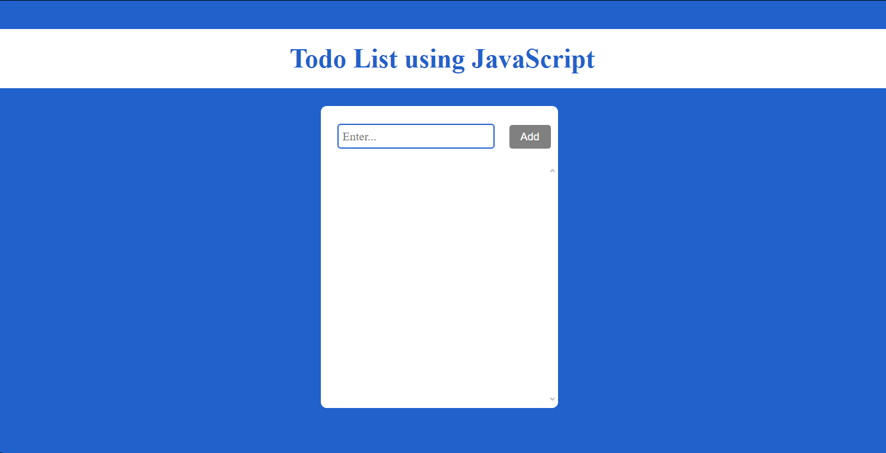

# To-Do List using JavaScript

Bu proje, JavaScript kullanarak oluşturduğum basit bir To-Do List (Yapılacaklar Listesi) uygulamasıdır. Kullanıcılar, listeye yeni görevler ekleyebilir, eklenen görevleri listeleyebilir ve görevleri listeden kaldırabilirler.

## Özellikler

- Görev ekleme
- Görev silme

## Ekran Görüntüsü

## Kurulum

Bu projeyi yerel bilgisayarınızda çalıştırmak için sadece projenin dosyalarını indirin ve `index.html` dosyasını çalıştırın.

## Kullanım

1. "Enter..." alanına görev girin.
2. "Add" butonuna tıklayarak görevi ekleyin.
3. Görevler listede gözükecektir.
4. Eklenen görevin yanındaki çöp simgesi ile görevi silebilirsiniz.

## Dosya Yapısı

- `index.html`: HTML dosyası, uygulamanın temel yapısını içerir.
- `style.css`: CSS dosyası, uygulamanın stilini belirler.
- `script.js`: JavaScript dosyası, uygulamanın işlevselliğini sağlar.
- `remove.png`: Silme butonu için kullanılan ikon.

## İletişim

Bu proje, başlangıç seviyesinde bir To-Do List uygulamasıdır ve geliştirilebilir bir projedir. Proje hakkında herhangi bir sorunuz varsa, lütfen benimle iletişime geçin:

- E-posta: [erceyasinemre17@gmail.com](mailto:erceyasinemre17@gmail.com)
- Instagram: [ne_bilim17](https://www.instagram.com/ne_bilim17/)